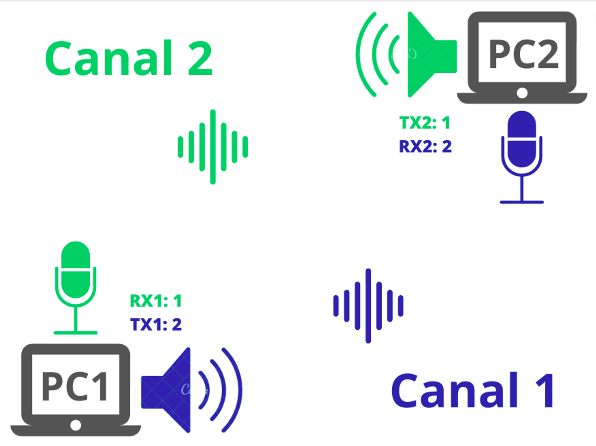

# Transferência de dados por ondas sonoras com FSK

> Projeto de TCC de Engenharia de Telecomunicações - IFSC Campus São José
> 

## Dependências

    - numpy==1.23.3
    - PyAudio==0.2.13

## Getting Started - Loopback

> Permite testar com apenas um computador. A parte Tx gera uma informação, transmite pelo ar e outra parte Rx monitora o som e decodifica o sinal recebido:
> 
1. Executar Rx
    
    ```bash
    cd Rx
    python3 rx.py
    ```
    
    Pronto. Você já está processando o áudio
    
2. Executar Tx
    
    ```bash
    cd Tx
    python3 tx.py
    ```
    
    Pronto. Você já está preparado para transmitir algo e receber pelo Rx. Digite algo agora!
    

---

## Getting Started - Transferir dados entre dispositivos

> Permite dois computadores distintos se comunicarem entre si. Para isso basta ajustar qual canal físico cada um vai utilizar para Rx e Tx. Um canal é um conjunto de 18 frequências. Há o canal 1 e o canal 2.
> 

Configure assim:

|  | PC1 | PC2 |
| --- | --- | --- |
| TX | 1 | 2 |
| RX | 2 | 1 |



### PC1

- Configuração do Rx1, linha 5, arquivo `rx.py`:
    
    ```bash
    channel = 1 # canal para comunicação
    ```
    
    Configuração Tx1, linha 8, `tx.py`:
    
    ```bash
    self.channel = 2 # Canal para comunicação
    ```
    

### PC2

- Configuração do Rx1, linha 5, arquivo `rx.py`:
    
    ```bash
    channel = 2 # canal para comunicação
    ```
    
    Configuração Tx1, linha 8, `tx.py`:
    
    ```bash
    self.channel = 1 # Canal para comunicação
    ```
    

Após os canais configurados, execute os mesmos passos do Lookback em cada PC:

1. Executar Rx
    
    ```bash
    cd Rx
    python3 rx.py
    ```
    
2. Executar Tx
    
    ```bash
    cd Tx
    python3 tx.py
    ```
    
    Agora você pode enviar e receber dados pelo som!