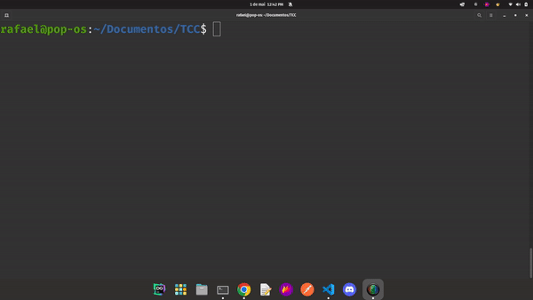
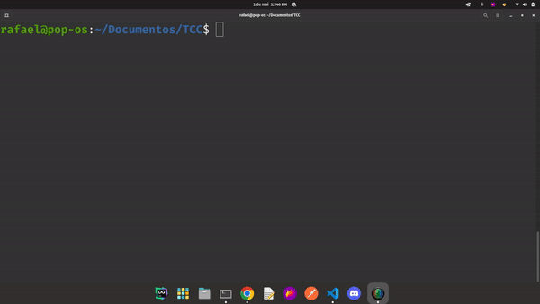
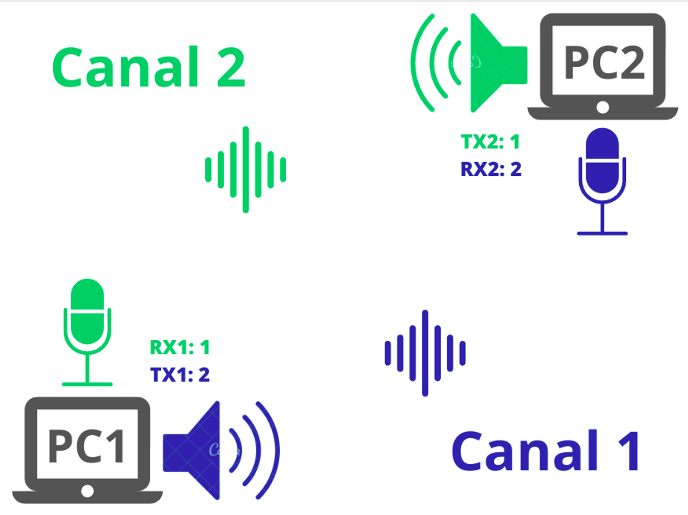

# Transferência de dados por ondas sonoras com FSK

> Projeto de TCC de Engenharia de Telecomunicações - IFSC Campus São José
> 

## Dependências

    - numpy==1.23.3
    - PyAudio==0.2.13

## Getting Started - Loopback

> Permite testar com apenas um computador. A parte Tx gera uma informação, transmite pelo ar e outra parte Rx monitora o som e decodifica o sinal recebido:
> 
1. Executar Rx
    
    ```bash
    python3 rx.py
    ```
    Escolha o canal 1 ou 2 para receber. Você já está processando o áudio.
    
    

2. Executar Tx
    
    ```bash
    python3 tx.py
    ```

    Escolha o canal 1 ou 2 para transmitir. Você já está preparado para transmitir algo e receber pelo Rx. Digite algo agora!

        

---

## Getting Started - Transferir dados entre dispositivos

> Permite dois computadores distintos se comunicarem entre si. Para isso basta ajustar qual canal físico cada um vai utilizar para Rx e Tx.
> 

Configure assim:

|  | PC1 | PC2 |
| --- | --- | --- |
| TX | 1 | 2 |
| RX | 2 | 1 |



    
Agora você pode enviar e receber dados pelo som ao mesmo tempo!